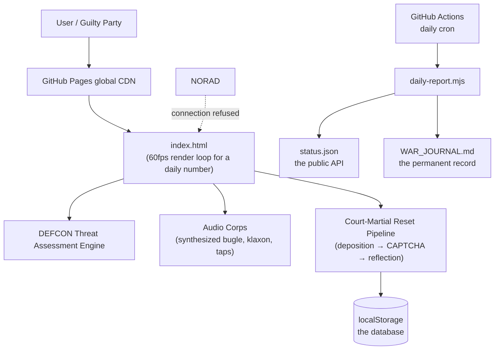

# Days Since Scott & Igor Played General Orders

> Mission-critical drought-monitoring infrastructure for a two-person board game night.

**Production:** https://scgrandpre.github.io/days-since-general-orders/

## Problem statement

Scott and Igor own the board game *General Orders*. They do not play it.
Existing solutions (remembering, texting each other) failed to scale.

## Architecture

## Key design decisions

- **Millisecond-precision countdown.** Days alone lacked gravitas.
- **DEFCON escalation.** The page's threat level rises with the drought. At 100
  days the site enters mourning (sepia) and displays a eulogy.
- **Court-martial reset flow.** Following the *Igor Incident* (2026-07-15, see
  [status page](https://scgrandpre.github.io/days-since-general-orders/status.html)),
  resets now require a sworn deposition, a board-game CAPTCHA, and a mandatory
  10-second reflection period. Security through bureaucracy.
- **Daily CI pipeline.** A GitHub Action recomputes a number that increments by
  exactly one per day and commits it, converting compute into disappointment
  at industrial scale.
- **Zero dependencies.** `npm install` was considered and rejected as a single
  point of failure. Also there is nothing to install.

## API

`GET /status.json` — machine-readable drought telemetry, refreshed daily by the
Adjutant (a robot). No auth, no rate limits, no reason to exist.

## Operations

| Runbook | Procedure |
|---|---|
| A game was actually played | Press the button. Survive the tribunal. |
| Igor pressed the button falsely | Bump `DATA_VERSION` in `index.html`, push, open incident. |
| Counter reaches 100 days | Send flowers. |

## Contributing

Contributions are not accepted. Playing the game is.
